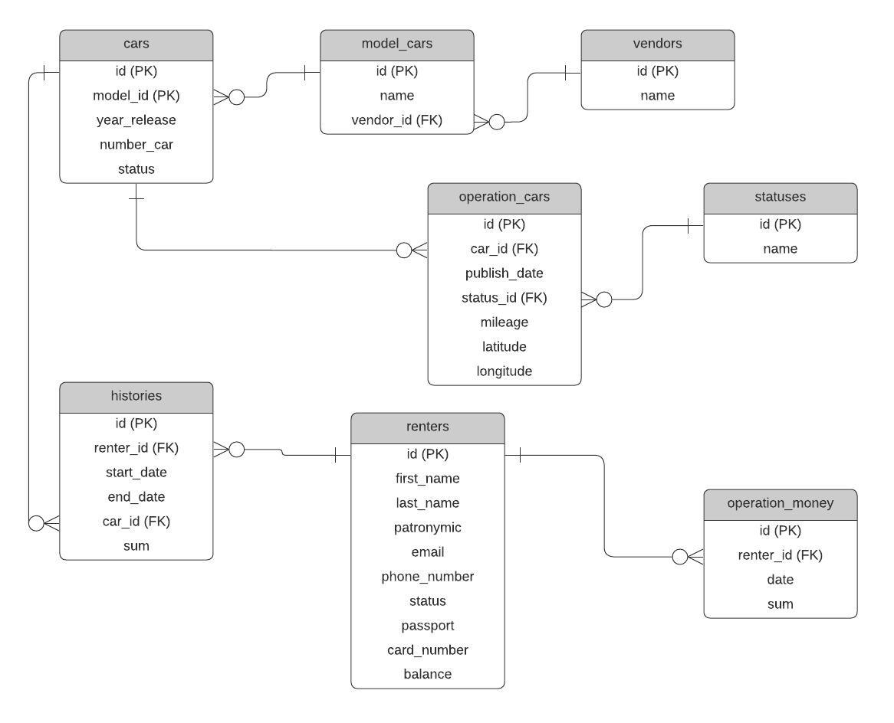

## Структура базы данных
### ER Диаграмма

### Таблицы

#### vendors - Производители ТС

- `id` - первичный ключ
- `name` - название производителя ТС

#### model_cars - Модели ТС

- `id` - первичный ключ
- `name` - название модели ТС
- `vendor_id` - внешний ключ для связи с `vendors`

#### cars - Транспортные средства

- `id` - первичный ключ
- `model_id` - внешний ключ для связи с `model_cars`
- `year_release` - год выпуска ТС
- `number_car` - гос. номер ТС
- `status` - статус ТС (в аренде/свободно)

#### operation_cars - События с автомобилем

- `id` - первичный ключ
- `car_id` - внешний ключ для связи с `cars`
- `publish_date` - время данного запроса
- `status_id` - внешний ключ для связи с `statuses`
- `mileage` - пробег ТС
- `latitude` - широта ТС
- `longitude` - долгота ТС

#### statuses - Возможные события

- `id` - первичный ключ
- `name` - название события (Взят, Сдан, Движение, Остановка, Опрос)

#### histories - История аренд

- `id` - первичный ключ
- `renter_id` - внешний ключ для связи с `renters`
- `start_date` - время взятия в аренду ТС
- `end_date` - время сдачи с аренды ТС
- `car_id` - внешний ключ для связи с `car`
- `sum` - итоговая сумма за поездку

#### renters - Арендаторы

- `id` - первичный ключ
- `first_name` - имя 
- `last_name` - фамилия 
- `patronymic` - отчество 
- `email` - почта
- `phone_number` - номер телефона
- `status` - статус (Активен, Неактивен, Заблокирован)
- `passport` - серия/номер паспорта
- `card_number` - номер карты
- `balance` - баланс

#### operation_money - Операции с балансом

- `id` - первичный ключ
- `renter_id` - внешний ключ для связи с `renters`
- `date` - дата операции
- `sum` - сумма операции